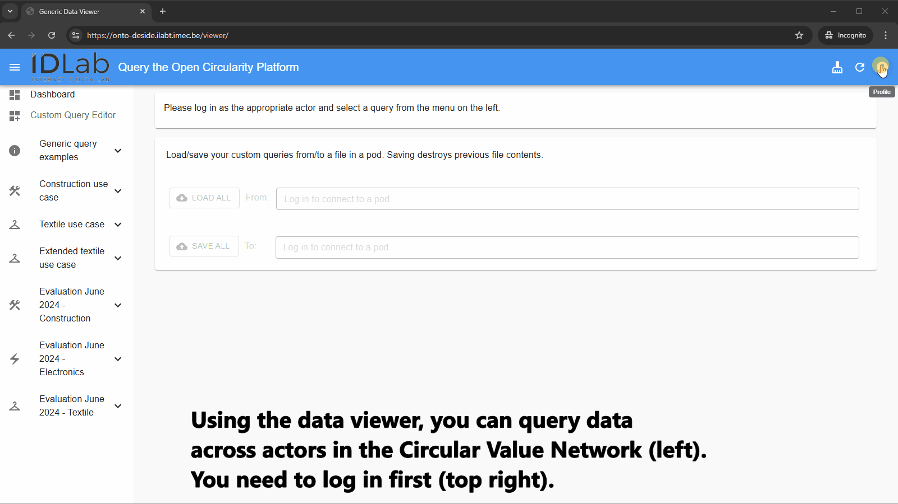

# Miravi - a linked data viewer

This Web app allows users to easily execute queries over multiple linked data sources (including Solid pods) and
inspect the corresponding results.

About the name: Miravi reflects the many facets of the web — linking open and permissioned data into a unified view.
Rooted in the Latin *mirari* ("to look with wonder"), it turns fragmented knowledge into meaningful insight.


Miravi is fully configurable. In the illustration below, [this configuration](./main/configs/onto-deside/config.json) is at work.



For a more complete presentation of Miravi and description of the design choices, please have a look at our
[presentation as presented during the SemDev Workhop co-located with SEMANTiCS 2025](./doc/slides-miravi-semdev-2025.pdf).

Table of contents:

* [Preface](#preface)
* [Prerequisites](#prerequisites)
* [Getting started](#getting-started)
* [The supporting resources](#the-supporting-resources)
* [Static, production build](#static-production-build)
* [Logging in](#logging-in)
* [Configuration file](#configuration-file)
  * [Writing SPARQL queries](#writing-sparql-queries)
  * [Specifying sources](#specifying-sources)
  * [About httpProxies](#about-httpproxies)
  * [Adding variable type](#adding-variable-type)
  * [Templated queries](#templated-queries)
    * [Templated queries with fixed values for the template variables](#templated-queries-with-fixed-values-for-the-template-variables)
    * [Templated queries with values for the template variables to be derived from the data](#templated-queries-with-values-for-the-template-variables-to-be-derived-from-the-data)
  * [Query icons](#query-icons)
* [Custom queries](#custom-queries)
* [Representation Mapper](#representation-mapper)
* [Advanced topics](#advanced-topics)
  * [Adding your own configuration](#adding-your-own-configuration)
  * [Converting custom queries into common queries](#converting-custom-queries-into-common-queries)
* [Illustrations](#illustrations)
* [For developers](#for-developers)
  * [Testing](#testing)
    * [Additional prerequisites](#additional-prerequisites)
    * [Testing the production version](#testing-the-production-version)
    * [Testing the development version](#testing-the-development-version)
  * [Release activities](#release-activities)

## Preface

This repository defines a Web application in the directory `main` and some supporting resources in the directory `test`.

The Web application is configured by the following configuration resources:

* file `main/src/config.json`;
* directory `main/public`.

In order to be able to maintain several different configurations (or *flavours*) in this repository, these configuration resources are *git-ignored*.
Before launching or building the application, their contents need to be copied from the appropriate subdirectory of `main/configs`.
The instructions below explain when and how to use the `select-config.cjs` script for this purpose.

## Prerequisites

* Node >= 18 with npm
* A Linux platform with a bash shell

## Getting started

To install:

```bash
npm install
```

The Web application is located in directory `main`.
Go to that directory.

To select the appropriate configuration (here shown for `demo`):

```bash
node scripts/select-config.cjs demo
```

To run the Web application in development mode:

```bash
npm run dev
```

Now you can browse the displayed URL.

In case of the `demo` configuration:

* you'll need to spin up the supporting resources as explained in section [The supporting resources](#the-supporting-resources);
* some queries require you to be logged in; log in at IDP `http://localhost:8080` as user `hello@example.com` with password `abc123`.

## The supporting resources

The supporting resources are located in directory `test`, along with some scripts useful for testing.

Resources:

* a local pod containing data used in the `demo` and `test` configurations;
* proxies used in the `demo` and `test` configurations.

Go to directory `test`.

Spin up resources:

```bash
npm run start:support
```

## Static, production build

To make a standalone version of the result of this project, you can make a static build and serve it using any webserver.

Go to directory `main`.

To select the appropriate configuration (here shown for `demo`):

```bash
node scripts/select-config.cjs demo
```

To build:

```bash
npm run build
```

The static build appears in directory `main/dist`.

This static build can be served on a webserver without modifications from the host's root path (e.g. `https://www.example.com`), or from any other path (e.g. `https://www.example.com/your/preferred/path`).

## Logging in

Some queries access data sources that are only readable by authenticated users. This requires you to log in.
To log in, you need to provide an Identity Provider or a WebID.
The application will detect which one you use and redirect you to the login page of your Identity Provider.
If you provide a WebID, the first Identity Provider found in the given WebID is used.

## Configuration file

The configuration file must follow the structure shown below.

```json
{
  "title": "Title shown at the top of the app.",
  "logoLocation": "Image location of the logo shown at the top of the app (relative to public folder.).",
  "logoRedirectURL": "The URL the Web application redirects to when a user clicks on the logo.",
  "defaultIDP": "The default value used for IDP when logging in, this IDP can be manually changed in the Web app as well. ",
  "queryFolder": "The base location of the SPARQL queries, all query locations will start from this folder (relative to public folder).",
  "introductionText": "The text that the app shows on the dashboard, which the app also shows when you first open it.",
  "queryGroups" : [
    {
      "id": "A unique ID for the query group",
      "name": "A name for the query group",
      "icon": "The key to the icon for the query group. This is optional and a default menu icon will be used when left empty."
    }
  ],
  "queries": [
    {
      "id": "A unique ID for the query. This ID appears in the URL of the displayed result. Queries are ordered in the menu according to ascending ID.",
      "queryGroupId": "ID of the query group too which this query belongs. If not given, the query is displayed outside existing groups.",
      "queryLocation": "Path to the SPARQL query location, relative to 'queryFolder'",
      "name": "A name for the query",
      "description": "Description of the query",
      "icon": "The key to the icon for the query. This is optional and a default menu icon will be used when left empty.",
      "comunicaContext": {
        "sources": "Initial array of sources over which the query should be executed",
        ... any other field that can be used in the Comunica query engine https://comunica.dev/docs/query/advanced/context/
      },
      "sourcesIndex": {
        "url": "URL of the publicly available RDF resource acting as an index file for more sources over which the query should be executed",
        "queryLocation": "Path to the location, relative to 'queryFolder', of the (auxiliary) query that yields the sources from above RDF resource"
      },
      "variables": {
        "variableExampleStrings": ["\"String1\"", "\"String2\""],
        "variableExampleUris": ["<https://example.com/uri1>", "<https://example.com/uri2>"],
        "variableExampleLangStrings": ["\"String1\"@en", "\"Chaîne2\"@fr"],
        "variableExampleTypedLiterals": [
          "\"1\"^^<http://www.w3.org/2001/XMLSchema#integer>",
          "\"1.3\"^^<http://www.w3.org/2001/XMLSchema#decimal>",
          "\"1.5E6\"^^<http://www.w3.org/2001/XMLSchema#double>",
          "\"true\"^^<http://www.w3.org/2001/XMLSchema#boolean>"
        ]   
      },
      "indirectVariables": {
        "queryLocations": [
          "Path to the location, relative to 'queryFolder' of a query yielding some template variable values",
          ...
        ]
      },
      "httpProxies": [
        {
          "urlStart": "all sources whose url start with this string will be rerouted",
          "httpProxy": "http proxy through which these sources will be rerouted - see also documentation 'About httpProxies' below."
        }
        ...
      ],
      "askQuery": {
        "trueText": "The text that is to be shown when the query result is true (in ASK queries).",
        "falseText": "The text that is to be shown when the query result is false (in ASK queries)."
      }
    },
    ... etc
  ]
}
```

### Writing SPARQL queries

Write each [SPARQL query](https://www.w3.org/TR/sparql11-query/) in a separate file (see `queryLocation` in the configuration file).

The following restrictions apply to SPARQL queries in Miravi:

* Mark your query variables with `?`, not with `$`. The `$` sign is reserved for use in [templated queries](#templated-queries).
* Do not use `_` in variable names, unless for [adding variable type](#adding-variable-type).
* Do not use `id` as a variable name. It is reserved for internal use.

### Specifying sources

The set of sources over which a query will be executed is derived from two *optional* inputs in a query entry:

* `comunicaContext.sources`: an array of sources, known at the time of writing the config file;
* `sourceIndex`: describes an external RDF resource, from which sources are derived at execution time.

If both inputs are present, the query will be executed over the superset of sources.

The (auxiliary) query provided in `sourceIndex.queryLocation` is executed on `sourceIndex.url` and must result in the list of source URLs.

If `sourceIndex` is used and there is no `comunicaContext.lenient` property found, one will be created with value `true`.
This makes sure that the (main) query can succeed if not all obtained sources are accessible.

### About httpProxies

Per query, an optional array of `httpProxies` can be specified.
An http proxy can be used to solve CORS issues in case CORS headers are not set (correctly) on some queried sources.
Note that the involved sources can include those specified in `comunicaContext.sources` as well as those described in and found through `sourceIndex`.

We support static proxies such as [cors-anywhere](https://www.npmjs.com/package/cors-anywhere) that take the URL from the path.

Each element of such array contains a property `httpProxies` and a property `urlStart`.

We simply prepend the `httpProxy` value before the URL of each source whose URL starts with the string in the corresponding `urlStart` value.

Example: if
`httpProxies[i].urlStart` is set to `http://www.example.com/path-xyz` and
`httpProxies[i].httpProxy` is set to `http://myproxy.org/`,
source `http://www.example.com/path-xyz-source-xyz` will be accessed as `http://myproxy.org/http://www.example.com/path-xyz-source-xyz`.

### Adding variable type

When executing a query, it gives us either a URL, a literal value or [a blank node](https://www.w3.org/TR/rdf12-concepts/#section-blank-nodes).
These URLs could reference to anything e.g. a picture, spreadsheet, resume, and so on.
Also literals can be lots of things e.g. a float, integer, string, birthdate, price, and so on.
By clarifying what the expected type is of the query result corresponding to a given variable
we can fully interpret how we can display and represent the result.

You can specify the type of a variable by extending its name with the type in the query as such: `variableName_variableType`.
The underscore `_` here is crucial to make a clear distinction between name and type.

### Templated queries

This application supports templated queries: queries whose contents are not completely fixed upfront.
They can contain *template variables*.
A template variable is an identifier preceded by a `$` sign, e.g. `$genre`.
Before submitting the SPARQL query, each template variable will be replaced by the actual value assigned to it interactively.

#### Templated queries with fixed values for the template variables

If all possible values for the template variables are fixed and hence can be written in the config file, proceed as follows.

* Replace the fixed portion(s) of the original query with (a) template variable(s).
* In the config file:
  * Add a `variables` object in the query's entry in the configuration file.
  * In the `variables` object, for each template variable, add a property with name equal to the template variable's identifier.
  * Set each such property's value to an array of strings, where each string is a possible value for the corresponding template variable.

Note that template variables' values are not restricted to strings: URIs for example are also possible.
As a consequence, for strings the surround double quotes `"` must be added to the values in the array.
For URIs you must add surrounding angle brackets `<>`.
Other literals (integers for example) don't have to be surrounded with extra delimiters.
This is shown in the configuration structure above.

#### Templated queries with values for the template variables to be derived from the data

In most cases, the values for the template variables are not fixed, but depend on *the data to query*.
For those cases, these values can be specified indirectly, by referring to one or more auxiliary queries.
Proceed as follows.

* Write one or more auxiliary queries that yield the values of the template variable(s).
  The variable names in the SELECT statement must match the template variable names (e.g `?genre` for template variable `$genre`).
* Replace the fixed portion(s) of the original query with (a) template variable(s).
* In the config file:
  * Add an `indirectVariables` object in the query's entry in the configuration file.
  * In the `indirectVariables` object, add a property `queryLocations`: this must be an *array*,
    listing the location(s) of the one or more auxiliary queries that you wrote.

An example auxiliary query for the variable `$genre`, as used in one of the provided example templated queries:

```text
PREFIX schema: <http://schema.org/> 

SELECT DISTINCT ?genre WHERE {
  ?list schema:genre ?genre;
} 
```

### Query icons

In the selection menu the name of the query is proceeded by an icon.
You configure this icon per query in the configuration file.  
For this to work you need to add the icon to the exports in [IconProvider.js](./main/src/IconProvider/IconProvider.js).
We advise to use the [Material UI icons](https://material-ui.com/components/material-icons/) as this is what's used internally in `react-admin` and it is also included in the dependencies.
Nevertheless, you can use any React component you want, just make sure it's a functional component.

## Custom queries

The configuration file contains prepared, fixed queries.
In addition, a user can create and edit custom queries, either from scratch or based on an existing query.

* To create a new custom query from scratch:
  * Open "Custom Query Editor" from the menu on the left.
  * Complete the custom query editor form and click the "CREATE QUERY" button when ready.
  * Your new query is added to the "Custom queries" group and you are redirected to the query's result view.
  * If not satisfied with the query result, you can click "EDIT QUERY" to further edit your query.
    When saving changes, the result is recalculated.

* To create a new custom query based on an existing query:
  * Open the existing query.
  * Click "CLONE AS CUSTOM QUERY" (in a normal query) or "CLONE" (in a custom query).
  * Make the desired changes in the form and click the "CREATE QUERY" button when ready. The new custom query behaves as if it were created from scratch.

* To share a custom query, a "SHARE QUERY" button is provided.
  Use it to generate a unique URL for this custom query.
  Visiting that URL any time later, recreates a custom query with the same specifications.
  This may be useful to share a custom query to another user or to save it for yourself.

* To clean up an unwanted custom query, there is always a button "DELETE QUERY"...

**Warning**: custom queries are stored in your browser's memory and will disappear if the browser page is refreshed or when switching logins.

Logged in users however have the possibility to save/load their custom queries to/from a selectable location in their Solid pod, via the buttons in the Dashboard.

## Representation Mapper

If you want to add your own type representations
you can do this by adding your representation to the [representationProvider.js](./main/src/representationProvider/representationProvider.js) file.
This can be useful for example when querying images.
The result of the query is a reference to the image.
By mapping a representation we can show the actual image instead of the reference.

The mapper follows a structure:

```json
{
    "typeName": mapperComponent,
    ...
}
```

With `typeName` being the name of the variable as defined in the `query`
which is defined in [the configuration file](#configuration-file).
The function `mapperComponent` takes the query result for the corresponding variable and
returns either a [React](https://react.dev/) component (see below).
Examples of how you can do this can already be found in the [representationProvider components folder](./main/src/representationProvider/components/).

The components get the following props:

* `record` (the query result), an object of `RDF/JS` objects.
* `variable` the variable name and key of `record`, a string.

`Hint` use the [Field components](https://marmelab.com/react-admin/doc/3.19/Fields.html#basic-fields)
from `react-admin` to display the result.
They've already got styling matching that of `react-admin` and are easy to use.

`Warning` if you change the record object, the changed will still be present in the next render.

## Advanced topics

### Adding your own configuration

The easiest way to add your own configuration is:

1. Get inspired by the configuration in `main/configs/demo`.
2. Choose your `<your-config>`: a string obeying regex `[a-z0-9-]+`; directory `main/configs/<your-config>` should not yet be in use.
3. Add your own queries in the `main/configs/<your-config>/public/queries` directory and in general, your own resources in the `main/configs/<your-config>/public` directory.
4. Add your own additional resources in `main/configs/<your-config>/public`, if the defaults you'll get from `main/config-defaults/public` are not satisfactory for you.
5. Write your own `main/configs/<your-config>/config.json` file, following the [configuration file documentation above](#configuration-file).
6. Run or build as documented above for the `demo` configuration, of course now using `<your-config>`.
7. Consider a pull request to add your configuration to this repo.

### Converting custom queries into common queries

Once you have your basic configuration working, you may extend it with custom queries interactively with the query editor
and save these to a file in a pod.
You can convert such custom queries into common queries, by adding them to `main/configs/<your-config>/config.json`.
Follow these steps to get started:

1. **Open and view the file with custom queries** using a tool, such as [Penny](https://penny.vincenttunru.com/). The file has JSON syntax and contains an array of query objects.
2. **Copy the query objects of interest** to the `"queries"` array in `main/configs/<your-config>/config.json`.
   Note that the various queries that were documented in the [configuration file documentation above](#configuration-file) in `"queryLocation"` properties,
   appear here as `"queryString"` variants, with inline contents rather than references to query files (`*.rq`).
   Leave as is or convert to query files as you like.
   Inline queries may be hard to read due to the difficult newline coding in JSON syntax.
3. **Update the `"queryGroupId"` property** in all these queries, to separate them from the custom queries. Ensure the group exists in the `"queryGroups"` array, or create a new group if you prefer.
4. **Update the `"id"` property**, to avoid conflicts with remaining custom queries: the id must be unique and it also defines the position in the query group.
5. **Adapt any other properties** according to your preferences.
6. **Save `main/configs/<your-config>/config.json`**, rerun or rebuild and refresh your browser to test.

## Illustrations

* [A screencast about configs/onto-deside](doc/screencast-onto-deside.gif)
* [Presentation as presented during the SemDev Workhop co-located with SEMANTiCS 2025](./doc/slides-miravi-semdev-2025.pdf)

## For developers

### Testing

> It is important to test the production version at least at the end of a development cycle.

The development version might be tested repeatedly during development.

Both the production version and the development version are tested from a non-empty path in the base URL.

#### Additional prerequisites

Testing uses [Cypress](https://docs.cypress.io/app/get-started/why-cypress).
The app will be installed with `npm install` as documented below, but you need to do take care of additional [Linux prerequisites](https://docs.cypress.io/app/get-started/install-cypress#Linux-Prerequisites).

We instruct Cypress to use the Chrome browser, so you'll need it on your system. Installation example:

```bash
sudo apt update
sudo apt -y upgrade
sudo apt -y autoremove
cd ~
wget https://dl.google.com/linux/direct/google-chrome-stable_current_amd64.deb
sudo apt -y install ./google-chrome-stable_current_amd64.deb
```

#### Testing the production version

1. Build the production version of the Web application and serve it:

   In directory `main`:

   ```bash
   # make really, really sure to build from scratch
   rm -rf node_modules/
   rm -rf dist/
   npm install
   # select the test configuration
   node scripts/select-config.cjs test
   # build
   npm run build
   ```

   In directory `test`:

   ```bash
   npm run serve
   ```

2. Spin up all supporting resources, as explained in [The supporting resources](#the-supporting-resources).

3. Finally, in a new terminal window, in directory `test`, you can execute the tests by running:

   For normal test execution:

   ```bash
   npm run test
   ```

   For interactive testing:

   ```bash
   npm run test:interactive
   ```

#### Testing the development version

The procedure is the same as for testing the production version, except for step 1, which is now:

1. Start the Web application in development mode, using a non-empty path in the base URL:

   In directory `main`:

   ```bash
   npm run dev-with-path
   ```

### Release activities

See [RELEASE.md](./RELEASE.md).
